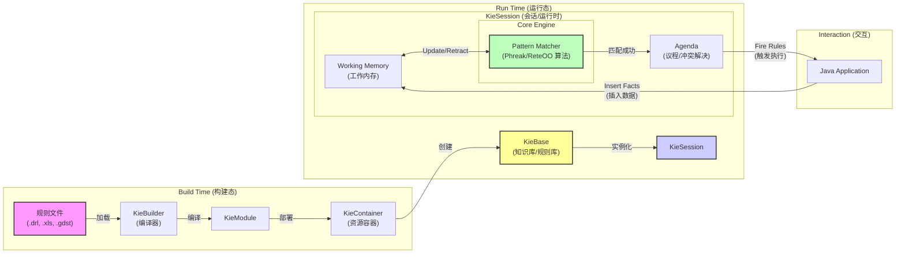

```mermaid
graph LR
    subgraph "Build Time (构建态)"
        Resources["规则文件<br/>(.drl, .xls, .gdst)"] -->|加载| KBuilder["KieBuilder<br/>(编译器)"]
        KBuilder -->|编译| KModule[KieModule]
        KModule -->|部署| KContainer["KieContainer<br/>(资源容器)"]
    end

    subgraph "Run Time (运行态)"
        KContainer -->|创建| KBase["KieBase<br/>(知识库/规则库)"]
        
        subgraph "KieSession (会话/运行时)"
            WM["Working Memory<br/>(工作内存)"]
            Agenda["Agenda<br/>(议程/冲突解决)"]
            
            subgraph "Core Engine"
                Matcher["Pattern Matcher<br/>(Phreak/ReteOO 算法)"]
            end
        end
        
        KBase -->|实例化| KieSession
    end

    subgraph "Interaction (交互)"
        App["Java Application"] -->|"Insert Facts<br/>(插入数据)"| WM
        Matcher -->|匹配成功| Agenda
        Agenda -->|"Fire Rules<br/>(触发执行)"| App
        WM <-->|Update/Retract| Matcher
    end

    style Resources fill:#f9f,stroke:#333,stroke-width:2px
    style KBase fill:#ff9,stroke:#333,stroke-width:2px
    style KieSession fill:#ccf,stroke:#333,stroke-width:2px
    style Matcher fill:#bfb,stroke:#333,stroke-width:2px
```

