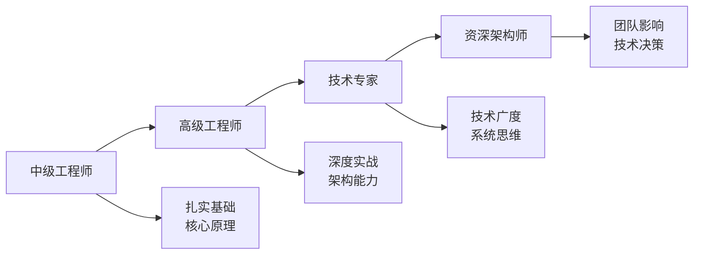

# 🚀 OpenTheDoor 技术成长之路

<div align="center" style="margin: 2rem 0;">

### 从中级工程师到资深架构师的系统化修炼

**📖 原理优先 · 📝 实战驱动 · 🎯 系统成长 · 💡 架构思维**

---

*7年 Java 开发者的技术修炼笔记 | 补齐短板 · 提升竞争力*

</div>

---

## 🎯 成长路线图



### 🔄 当前定位
- **起点**：8年 Java开发经验，熟悉 Docker 和云原生
- **短板**：编程基础能力待提升，缺少系统化知识体系
- **目标**：补齐基础短板 → 建立架构思维 → 成为技术专家

---

## 📊 能力矩阵与学习规划

### 🎨 技能象限分析

<table>
<tr>
<th width="50%">⭐ 重要且紧急（优先级：P0）</th>
<th width="50%">⭐⭐ 重要但不紧急（优先级：P1）</th>
</tr>
<tr>
<td valign="top">

**补齐基础短板**
- ☕ Java 核心基础
- 🔐 安全与认证
- 🗄️ 数据库优化
- 📈 并发编程

*目标：3-6个月内掌握*

</td>
<td valign="top">

**建立架构思维**
- 🏗️ 系统设计
- 🌱 Spring 源码
- ☁️ 云原生深入
- 📊 性能优化

*目标：6-12个月内精通*

</td>
</tr>
<tr>
<th>🔹 紧急但不重要（优先级：P2）</th>
<th>🔸 不紧急不重要（长期储备）</th>
</tr>
<tr>
<td valign="top">

**面试准备**
- 💼 算法刷题
- 📝 八股文整理
- 🎯 项目亮点提炼

*目标：随时准备*

</td>
<td valign="top">

**技术广度扩展**
- 🦀 Rust/Go 等新语言
- 🤖 AI/机器学习
- 🎮 其他技术栈

*目标：技术视野*

</td>
</tr>
</table>

---

## 📚 学习路径（按优先级）

### 🎯 阶段一：夯实基础（P0 优先级）

<div class="phase-card">

#### 🔐 1.1 安全与认证 <span class="status-completed">✅ 已完成</span>

**为什么从这里开始？** 外包项目常见需求，立即可用于工作，且涉及多个核心概念

- 📖 [认证授权基础](auth/01-认证授权基础.md) - 认证 vs 授权、Session vs Token、RBAC/ABAC
- 🔑 [认证协议与标准](auth/02-认证协议与标准.md) - OAuth 2.0、JWT、OpenID Connect、SSO
- ⚖️ [Java认证框架对比](auth/03-Java认证框架对比.md) - Spring Security vs Shiro 技术选型
- 🏗️ [Spring Security 核心架构](auth/04-SpringSecurity核心架构.md) - 过滤器链、认证流程、授权机制
- ⚙️ [Spring Security 实战配置](auth/05-SpringSecurity实战配置.md) - 配置技巧、自定义扩展
- 🌐 [Spring Security OAuth2](auth/06-SpringSecurity-OAuth2.md) - 授权服务器、资源服务器实战
- 💻 [代码示例集](auth/07-代码示例集.md) - JWT、OAuth2、RBAC 完整示例
- 🚀 [高级主题与最佳实践](auth/08-高级主题与最佳实践.md) - 性能优化、安全加固

**收获**：掌握企业级安全方案，能独立设计认证授权系统 → **提升到高级工程师必备能力**

---

#### ☕ 1.2 Java 核心基础 <span class="status-planning">📋 近期启动</span>

**为什么重要？** 这是"内功"，决定了代码质量和问题排查能力的上限

**🔹 集合框架源码**
- ArrayList vs LinkedList 性能对比与场景选择
- HashMap 底层实现（数组+链表+红黑树）
- ConcurrentHashMap 并发安全机制
- 常见集合类的线程安全版本

**🔹 并发编程深入**
- Thread、Runnable、Callable 的区别与应用
- synchronized、Lock、ReentrantLock 原理
- AQS（AbstractQueuedSynchronizer）源码分析
- 线程池原理与参数调优
- volatile、CAS、ThreadLocal 深入理解

**🔹 JVM 原理与调优**
- 内存模型（堆、栈、方法区、直接内存）
- 垃圾回收算法（标记清除、复制、标记整理）
- 垃圾回收器对比（Serial、Parallel、CMS、G1、ZGC）
- 类加载机制与双亲委派
- JVM 参数调优与问题排查

**收获**：理解 Java 底层原理，能解决复杂并发问题和性能瓶颈 → **从"会用"到"精通"的关键跨越**

---

#### 🗄️ 1.3 MySQL 深入优化 <span class="status-planning">📋 近期启动</span>

**为什么优先？** 80% 的性能问题出在数据库，这是"中级→高级"的分水岭

- 索引原理与优化（B+树、覆盖索引、索引失效）
- SQL 执行计划分析（EXPLAIN 详解）
- 事务与锁机制（MVCC、间隙锁、死锁排查）
- 主从复制与读写分离
- 分库分表策略

**收获**：能独立优化慢SQL，设计高性能数据库方案 → **高级工程师核心竞争力**

</div>

---

### 🚀 阶段二：深度实战（P1 优先级）

<div class="phase-card">

#### 🌱 2.1 Spring 框架源码 <span class="status-future">🔮 中期规划</span>

**为什么学源码？** 理解框架设计思想，面试高频，架构能力的基础

- **Spring Core** - IoC 容器实现、Bean 生命周期、AOP 原理
- **Spring Boot** - 自动配置原理、Starter 开发、监控与运维
- **Spring Cloud** - 微服务架构、服务注册与发现、配置中心

**收获**：能回答"为什么这样设计"，具备框架设计能力 → **技术专家的必经之路**

---

#### ☁️ 2.2 云原生实践 <span class="status-inprogress">⚡ 结合项目</span>

**为什么有优势？** 已有Docker经验，正在做AI算力平台项目，可以边学边用

- **Docker 深入** - 镜像构建优化、网络模式、存储驱动
- **Kubernetes** - Pod、Service、Deployment、StatefulSet
- **Nomad 实战** - 轻量级调度（当前项目使用）
- **服务网格** - Tailscale 组网方案

**收获**：成为团队云原生技术负责人 → **差异化竞争力**

---

#### 🗄️ 2.3 Redis 与缓存设计 <span class="status-future">🔮 中期规划</span>

- 5种数据结构底层实现
- 持久化机制（RDB vs AOF）
- 缓存击穿、穿透、雪崩解决方案
- Redis 集群与高可用

**收获**：设计高性能缓存方案 → **系统架构能力提升**

</div>

---

### 🏗️ 阶段三：架构思维（P1-P2 优先级）

<div class="phase-card">

#### 🏛️ 3.1 系统设计与架构 <span class="status-future">🔮 长期目标</span>

**为什么是最终目标？** 这是"高级→专家→架构师"的关键能力

- **微服务架构** - 服务拆分原则、API 网关、服务治理
- **分布式系统** - CAP/BASE 理论、分布式事务、一致性协议
- **高并发系统** - 限流降级、消息队列、数据库优化
- **系统重构** - 从单体到微服务的演进策略

**收获**：能独立设计千万级系统架构 → **资深架构师核心能力**

---

#### 📊 3.2 性能优化实战 <span class="status-future">🔮 长期目标</span>

- JVM 调优实战
- 数据库性能优化
- 接口响应时间优化
- 系统容量规划

**收获**：解决复杂性能问题 → **技术专家必备技能**

</div>

---

### 🛠️ 工具链与效率提升

<div class="phase-card">

#### 🔧 DevOps 与工具 <span class="status-inprogress">⚡ 持续更新</span>

- 📦 [MkDocs + GitHub Pages 搭建技术博客](devops/01-博客搭建指南.md) - 完整搭建教程
- 🔄 Docker 容器化实践
- 🚀 GitHub Actions CI/CD
- 📈 监控与日志系统

**收获**：提升开发效率，建立个人技术品牌

</div>


---
### 技术特点
- ☁️ 对 Docker 和云原生技术有深入理解
- 🔧 熟悉微服务架构和分布式系统
- 📈 正在系统性补齐核心编程能力

### 学习目标
- 🎯 **提升编程基础能力**：深入理解 Java 核心原理
- 🏗️ **建立架构思维**：从代码到系统设计的全面提升
- 💼 **面试准备**：补齐知识短板，提高竞争力
- 🚀 **项目实战**：理论联系实际，解决真实问题

---

## 🎯 学习特色

### 📝 内容质量
- **原理优先**：不只记录 API 用法，更要理解为什么这样设计
- **代码注释**：所有示例都有详细的中英文双语注释
- **场景驱动**：结合真实项目场景和常见业务需求
- **面试导向**：标注高频面试问题和标准回答思路

### 🛠️ 实践导向
- **完整代码**：提供可直接运行的完整示例，不是代码片段
- **最佳实践**：强调生产环境的代码质量和工程化思维
- **问题解决**：记录实际遇到的问题和解决方案
- **持续更新**：随着理解深入不断完善和补充

### 📚 知识组织
每个主题都按照统一的结构组织：
```
1. 概念定义 (What) - 这是什么
2. 核心原理 (Why) - 为什么需要/工作原理
3. 使用场景 (When) - 什么时候用
4. 实践示例 (How) - 怎么使用
5. 最佳实践 (Best Practice) - 生产环境建议
6. 面试要点 (Interview Tips) - 常见问题解析
```

---

## 🚀 如何使用

### 📖 在线阅读（推荐）
访问 **[GitHub Pages](https://zhangzimingmmz.github.io/OpenTheDoor/)** 在线阅读，获得最佳体验：
- 🎨 现代化的 Material Design 主题
- 🔍 强大的全文搜索功能
- 🌙 支持深色/浅色模式切换
- 📱 响应式设计，支持移动端

### 💻 本地阅读
使用 [Obsidian](https://obsidian.md/) 打开本仓库：
- 🔗 支持双向链接和关系图谱
- 📝 实时预览和编辑
- 🎯 强大的笔记管理功能

### 🤝 交流与反馈
- 💬 发现错误或有建议？欢迎提 [Issues](https://github.com/zhangzimingmmz/OpenTheDoor/issues)
- ⭐ 觉得有帮助？给个 Star 鼓励一下
- 🔀 想要补充内容？欢迎提 Pull Request

---

## 📞 关于我

- 💼 7年 Java 开发工程师，关注云原生和微服务
- 🎯 持续学习者，相信系统化积累的力量
- 📧 GitHub: [@zhangzimingmmz](https://github.com/zhangzimingmmz)

---

<div align="center">

**💪 每天进步一点点，持续学习，不断成长！**

*"学习不是为了应付面试，而是为了成为更好的工程师"*

⭐ 如果这个知识库对你有帮助，欢迎 Star 支持  
🔄 持续更新中... | 最后更新：2025年10月

</div>

