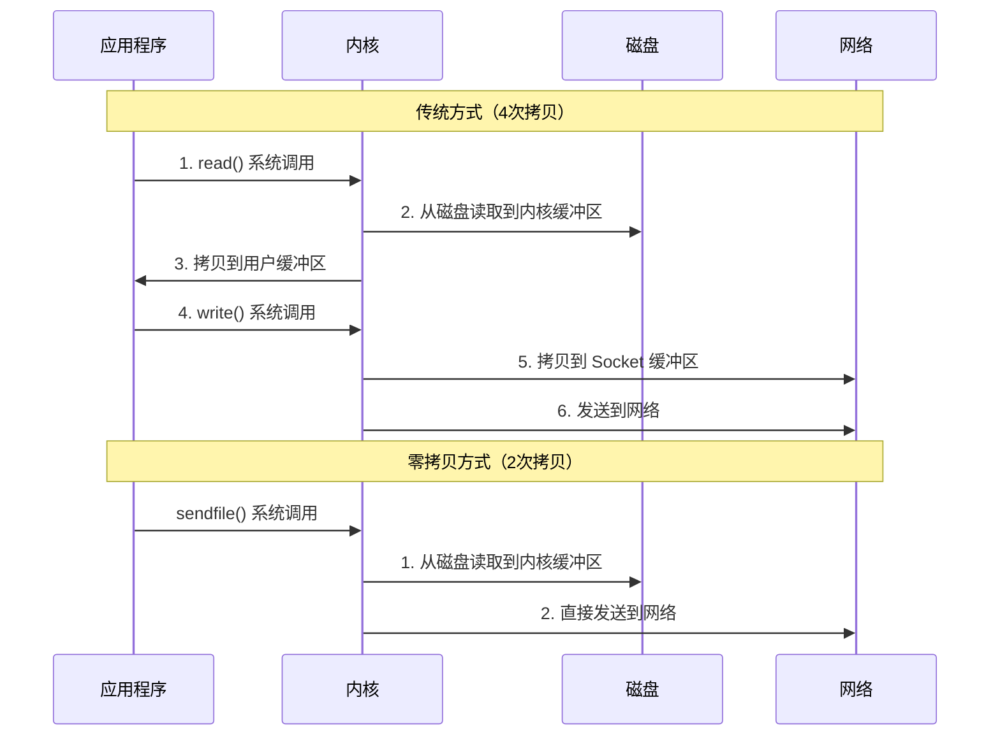

# Kafka 基础入门

## 📖 目录

- [1. 什么是 Kafka](#1-什么是-kafka)
- [2. 为什么需要 Kafka](#2-为什么需要-kafka)
- [3. Kafka 核心架构](#3-kafka-核心架构)
- [4. 安装与部署](#4-安装与部署)
- [5. 快速开始](#5-快速开始)
- [6. 常见面试题](#6-常见面试题)

---

## 1. 什么是 Kafka

### 1.1 定义

**Apache Kafka** 是一个开源的分布式流式处理平台（Distributed Streaming Platform），最初由 LinkedIn 开发，后捐赠给 Apache 基金会。

!!! quote "官方定义"
    Kafka 是一个分布式、分区化、可复制的提交日志服务（Distributed, Partitioned, Replicated Commit Log Service）

### 1.2 核心特性

- **高吞吐量** - 单机百万级消息/秒，支持水平扩展
- **持久化存储** - 消息持久化到磁盘，支持消息回溯
- **分布式架构** - 天然支持集群，高可用、可扩展
- **流式处理** - 支持流式数据处理，与 Flink、Spark 集成
- **多订阅者** - 支持多个消费者组同时消费同一主题

### 1.3 应用场景

| 场景 | 说明 | 示例 |
|:---|:---|:---|
| **日志收集** | 集中式日志收集和分析 | ELK 栈（Elasticsearch + Logstash + Kibana） |
| **流式处理** | 实时数据流处理 | 实时推荐系统、实时风控 |
| **事件溯源** | 事件驱动架构 | 微服务间的事件通信 |
| **消息总线** | 微服务消息通信 | 服务解耦、异步处理 |
| **指标监控** | 应用指标收集 | Prometheus、Grafana 集成 |

---

## 2. 为什么需要 Kafka

### 2.1 传统消息队列的局限性

#### ❌ 问题 1：吞吐量不足

传统消息队列（如 RabbitMQ）在单机场景下吞吐量有限，难以满足大数据场景的需求。

```
传统消息队列：单机 10万-20万 消息/秒
Kafka：单机 100万+ 消息/秒
```

#### ❌ 问题 2：消息持久化能力弱

传统消息队列通常将消息存储在内存中，消息消费后即删除，不支持消息回溯。

#### ❌ 问题 3：扩展性差

传统消息队列难以水平扩展，集群管理复杂。

### 2.2 Kafka 的优势

!!! success "Kafka 的核心优势"
    1. **高吞吐量** - 通过顺序写入磁盘、零拷贝等技术实现高性能
    2. **持久化存储** - 消息持久化到磁盘，支持按时间、偏移量回溯
    3. **水平扩展** - 通过增加 Broker 和 Partition 实现水平扩展
    4. **流式处理** - 原生支持流式数据处理，与大数据生态无缝集成

### 2.3 Kafka vs 传统消息队列

| 对比项 | Kafka | RabbitMQ | RocketMQ |
|:---|:---:|:---:|:---:|
| **设计目标** | 大数据流式处理 | 企业级消息队列 | 金融级消息队列 |
| **吞吐量** | ⭐⭐⭐⭐⭐ | ⭐⭐⭐ | ⭐⭐⭐⭐ |
| **消息持久化** | ✅ 磁盘持久化 | ⚠️ 可选 | ✅ 磁盘持久化 |
| **消息回溯** | ✅ 支持 | ❌ 不支持 | ✅ 支持 |
| **顺序保证** | ✅ Partition 内有序 | ✅ 队列有序 | ✅ 队列有序 |
| **适用场景** | 大数据、日志 | 业务解耦 | 电商、金融 |

---

## 3. Kafka 核心架构

### 3.1 整体架构图

```mermaid
graph TB
    subgraph "Producer 生产者"
        P1[Producer 1]
        P2[Producer 2]
    end
    
    subgraph "Kafka Cluster 集群"
        subgraph "Broker 1"
            T1[Topic: orders<br/>Partition 0]
            T2[Topic: orders<br/>Partition 1]
        end
        subgraph "Broker 2"
            T3[Topic: orders<br/>Partition 0 Replica]
            T4[Topic: orders<br/>Partition 1]
        end
        subgraph "Broker 3"
            T5[Topic: orders<br/>Partition 0]
            T6[Topic: orders<br/>Partition 1 Replica]
        end
        ZK[Zookeeper<br/>协调服务]
    end
    
    subgraph "Consumer Group 消费者组"
        CG1[Consumer Group A<br/>Consumer 1, 2]
        CG2[Consumer Group B<br/>Consumer 1]
    end
    
    P1 --> T1
    P1 --> T2
    P2 --> T1
    P2 --> T2
    
    T1 -.副本同步.-> T3
    T1 -.副本同步.-> T5
    T2 -.副本同步.-> T4
    T2 -.副本同步.-> T6
    
    CG1 --> T1
    CG1 --> T2
    CG2 --> T1
    CG2 --> T2
    
    ZK -.协调.-> Broker 1
    ZK -.协调.-> Broker 2
    ZK -.协调.-> Broker 3
```

### 3.2 核心组件

#### 3.2.1 Broker（代理服务器）

**定义**：Kafka 集群中的每个服务器节点称为 Broker。

**职责**：
- 存储消息（Topic 和 Partition）
- 处理 Producer 的写入请求
- 处理 Consumer 的读取请求
- 副本同步和故障转移

**特点**：
- 每个 Broker 都有唯一的 ID（broker.id）
- Broker 之间通过 Zookeeper 协调
- 支持水平扩展（增加 Broker 数量）

#### 3.2.2 Topic（主题）

**定义**：消息的逻辑分类，类似于数据库中的表。

**特点**：
- 一个 Topic 可以有多个 Partition（分区）
- 多个 Producer 可以向同一个 Topic 发送消息
- 多个 Consumer Group 可以消费同一个 Topic

**示例**：
```
Topic: user-events        # 用户行为事件
Topic: order-events       # 订单事件
Topic: payment-events     # 支付事件
```

#### 3.2.3 Partition（分区）

**定义**：Topic 的物理分割，每个 Partition 是一个有序的消息队列。

**特点**：
- **顺序性**：Partition 内的消息是有序的
- **并行性**：不同 Partition 可以并行处理
- **扩展性**：通过增加 Partition 数量提高吞吐量
- **副本机制**：每个 Partition 可以有多个副本（Replica）

**分区策略**：
```java
// 默认分区策略：根据 Key 的哈希值选择分区
int partition = key.hashCode() % partitionCount;

// 如果没有 Key，则轮询分配
```

#### 3.2.4 Producer（生产者）

**定义**：向 Kafka Topic 发送消息的客户端。

**职责**：
- 创建消息
- 选择目标 Partition
- 发送消息到 Broker

**关键配置**：
- `acks` - 消息确认机制（0/1/all）
- `retries` - 重试次数
- `batch.size` - 批次大小
- `linger.ms` - 等待时间

#### 3.2.5 Consumer（消费者）

**定义**：从 Kafka Topic 读取消息的客户端。

**职责**：
- 订阅 Topic
- 从 Partition 读取消息
- 提交消费偏移量（Offset）

**关键配置**：
- `group.id` - 消费者组 ID
- `auto.offset.reset` - 偏移量重置策略（earliest/latest）
- `enable.auto.commit` - 是否自动提交偏移量

#### 3.2.6 Consumer Group（消费者组）

**定义**：一组 Consumer 的集合，共同消费一个 Topic。

**特点**：
- **负载均衡**：同一个 Consumer Group 内的 Consumer 平均分配 Partition
- **并行消费**：多个 Consumer Group 可以同时消费同一个 Topic
- **故障转移**：Consumer 故障时，其 Partition 会分配给其他 Consumer

**示例**：
```
Topic: orders (3个 Partition)
Consumer Group A: Consumer1, Consumer2, Consumer3
  - Consumer1 -> Partition 0
  - Consumer2 -> Partition 1
  - Consumer3 -> Partition 2

Consumer Group B: Consumer1
  - Consumer1 -> Partition 0, 1, 2 (全部)
```

#### 3.2.7 Offset（偏移量）

**定义**：Consumer 在 Partition 中的消费位置。

**特点**：
- 每个 Partition 维护独立的 Offset
- Offset 存储在 Kafka 内部 Topic（`__consumer_offsets`）或 Zookeeper
- 支持手动提交和自动提交

**示例**：
```
Partition 0: [msg0, msg1, msg2, msg3, msg4, ...]
              ↑
            Offset=2 (已消费到 msg2)
```

#### 3.2.8 Replica（副本）

**定义**：Partition 的副本，用于保证高可用。

**类型**：
- **Leader Replica**：处理读写请求的主副本
- **Follower Replica**：从 Leader 同步数据的副本

**ISR（In-Sync Replicas）**：
- 与 Leader 保持同步的副本集合
- 只有 ISR 中的副本才能被选为新的 Leader

### 3.3 消息存储机制

#### 3.3.1 顺序写入

Kafka 采用**顺序写入磁盘**的方式，充分利用磁盘顺序写入的高性能。

```
传统随机写入：100-200 MB/s
顺序写入：600-700 MB/s
```

#### 3.3.2 零拷贝（Zero Copy）

Kafka 使用零拷贝技术，减少数据在内核态和用户态之间的拷贝次数。



#### 3.3.3 分段存储（Segment）

Kafka 将 Partition 分成多个 Segment 文件，每个 Segment 文件大小固定（默认 1GB）。

```
Topic: orders
  Partition 0/
    ├── 00000000000000000000.log  (Segment 1)
    ├── 00000000000000000000.index
    ├── 00000000000001000000.log  (Segment 2)
    ├── 00000000000001000000.index
    └── ...
```

**优势**：
- 便于日志清理（删除旧的 Segment）
- 提高查找效率（通过索引文件）
- 支持消息压缩

---

## 4. 安装与部署

### 4.1 环境要求

- **Java**：JDK 8 或以上
- **操作系统**：Linux、macOS、Windows
- **内存**：建议 4GB 以上
- **磁盘**：SSD 推荐，用于消息存储

### 4.2 下载 Kafka

```bash
# 下载 Kafka（以 3.6.0 为例）
wget https://downloads.apache.org/kafka/3.6.0/kafka_2.13-3.6.0.tgz

# 解压
tar -xzf kafka_2.13-3.6.0.tgz
cd kafka_2.13-3.6.0
```

### 4.3 单机部署

#### 4.3.1 启动 Zookeeper

!!! note "注意"
    Kafka 3.0+ 版本支持 KRaft 模式（不需要 Zookeeper），但为了兼容性，这里仍使用 Zookeeper 模式。

```bash
# 启动 Zookeeper（Kafka 自带）
bin/zookeeper-server-start.sh config/zookeeper.properties

# 或者使用后台运行
nohup bin/zookeeper-server-start.sh config/zookeeper.properties > zookeeper.log 2>&1 &
```

#### 4.3.2 启动 Kafka Broker

```bash
# 启动 Kafka Broker
bin/kafka-server-start.sh config/server.properties

# 或者使用后台运行
nohup bin/kafka-server-start.sh config/server.properties > kafka.log 2>&1 &
```

#### 4.3.3 验证安装

```bash
# 查看 Topic 列表
bin/kafka-topics.sh --list --bootstrap-server localhost:9092

# 如果没有输出，说明安装成功（还没有创建 Topic）
```

### 4.4 Docker 部署（推荐）

#### 4.4.1 使用 Docker Compose

创建 `docker-compose.yml`：

```yaml
version: '3.8'

services:
  zookeeper:
    image: confluentinc/cp-zookeeper:7.5.0
    environment:
      ZOOKEEPER_CLIENT_PORT: 2181
      ZOOKEEPER_TICK_TIME: 2000
    ports:
      - "2181:2181"

  kafka:
    image: confluentinc/cp-kafka:7.5.0
    depends_on:
      - zookeeper
    ports:
      - "9092:9092"
    environment:
      KAFKA_BROKER_ID: 1
      KAFKA_ZOOKEEPER_CONNECT: zookeeper:2181
      KAFKA_ADVERTISED_LISTENERS: PLAINTEXT://localhost:9092
      KAFKA_OFFSETS_TOPIC_REPLICATION_FACTOR: 1
```

启动服务：

```bash
docker-compose up -d
```

### 4.5 集群部署

#### 4.5.1 配置文件

创建多个 Broker 配置文件：

```bash
# Broker 1
cp config/server.properties config/server-1.properties
# 修改配置
broker.id=1
listeners=PLAINTEXT://localhost:9092
log.dirs=/tmp/kafka-logs-1

# Broker 2
cp config/server.properties config/server-2.properties
# 修改配置
broker.id=2
listeners=PLAINTEXT://localhost:9093
log.dirs=/tmp/kafka-logs-2

# Broker 3
cp config/server.properties config/server-3.properties
# 修改配置
broker.id=3
listeners=PLAINTEXT://localhost:9094
log.dirs=/tmp/kafka-logs-3
```

#### 4.5.2 启动集群

```bash
# 启动所有 Broker
bin/kafka-server-start.sh config/server-1.properties &
bin/kafka-server-start.sh config/server-2.properties &
bin/kafka-server-start.sh config/server-3.properties &
```

---

## 5. 快速开始

### 5.1 创建 Topic

```bash
# 创建一个名为 "test-topic" 的 Topic，1个分区，1个副本
bin/kafka-topics.sh --create \
  --topic test-topic \
  --bootstrap-server localhost:9092 \
  --partitions 1 \
  --replication-factor 1

# 查看 Topic 详情
bin/kafka-topics.sh --describe \
  --topic test-topic \
  --bootstrap-server localhost:9092
```

**输出示例**：
```
Topic: test-topic	PartitionCount: 1	ReplicationFactor: 1	Configs: 
	Topic: test-topic	Partition: 0	Leader: 1	Replicas: 1	Isr: 1
```

### 5.2 发送消息（Producer）

```bash
# 启动 Producer，输入消息后按 Enter 发送
bin/kafka-console-producer.sh \
  --topic test-topic \
  --bootstrap-server localhost:9092
```

**交互示例**：
```
> Hello Kafka
> This is my first message
> 测试消息
```

### 5.3 消费消息（Consumer）

```bash
# 启动 Consumer，从最新位置开始消费
bin/kafka-console-consumer.sh \
  --topic test-topic \
  --from-beginning \
  --bootstrap-server localhost:9092
```

**输出示例**：
```
Hello Kafka
This is my first message
测试消息
```

### 5.4 Java 客户端示例

#### 5.4.1 添加依赖

```xml
<dependency>
    <groupId>org.apache.kafka</groupId>
    <artifactId>kafka-clients</artifactId>
    <version>3.6.0</version>
</dependency>
```

#### 5.4.2 Producer 示例

```java
import org.apache.kafka.clients.producer.KafkaProducer;
import org.apache.kafka.clients.producer.ProducerConfig;
import org.apache.kafka.clients.producer.ProducerRecord;
import org.apache.kafka.common.serialization.StringSerializer;

import java.util.Properties;

/**
 * Kafka Producer 示例
 * Kafka Producer Example
 */
public class SimpleProducer {
    
    public static void main(String[] args) {
        // 配置 Producer 属性
        Properties props = new Properties();
        props.put(ProducerConfig.BOOTSTRAP_SERVERS_CONFIG, "localhost:9092");
        props.put(ProducerConfig.KEY_SERIALIZER_CLASS_CONFIG, StringSerializer.class.getName());
        props.put(ProducerConfig.VALUE_SERIALIZER_CLASS_CONFIG, StringSerializer.class.getName());
        
        // 创建 Producer
        KafkaProducer<String, String> producer = new KafkaProducer<>(props);
        
        // 发送消息
        for (int i = 0; i < 10; i++) {
            ProducerRecord<String, String> record = new ProducerRecord<>(
                "test-topic",           // Topic
                "key-" + i,             // Key
                "message-" + i          // Value
            );
            
            // 异步发送
            producer.send(record, (metadata, exception) -> {
                if (exception == null) {
                    System.out.println("消息发送成功: " + 
                        "topic=" + metadata.topic() + 
                        ", partition=" + metadata.partition() + 
                        ", offset=" + metadata.offset());
                } else {
                    System.err.println("消息发送失败: " + exception.getMessage());
                }
            });
        }
        
        // 关闭 Producer
        producer.close();
    }
}
```

#### 5.4.3 Consumer 示例

```java
import org.apache.kafka.clients.consumer.ConsumerConfig;
import org.apache.kafka.clients.consumer.ConsumerRecord;
import org.apache.kafka.clients.consumer.ConsumerRecords;
import org.apache.kafka.clients.consumer.KafkaConsumer;
import org.apache.kafka.common.serialization.StringDeserializer;

import java.time.Duration;
import java.util.Collections;
import java.util.Properties;

/**
 * Kafka Consumer 示例
 * Kafka Consumer Example
 */
public class SimpleConsumer {
    
    public static void main(String[] args) {
        // 配置 Consumer 属性
        Properties props = new Properties();
        props.put(ConsumerConfig.BOOTSTRAP_SERVERS_CONFIG, "localhost:9092");
        props.put(ConsumerConfig.GROUP_ID_CONFIG, "test-consumer-group");
        props.put(ConsumerConfig.KEY_DESERIALIZER_CLASS_CONFIG, StringDeserializer.class.getName());
        props.put(ConsumerConfig.VALUE_DESERIALIZER_CLASS_CONFIG, StringDeserializer.class.getName());
        props.put(ConsumerConfig.AUTO_OFFSET_RESET_CONFIG, "earliest"); // 从最早的消息开始消费
        
        // 创建 Consumer
        KafkaConsumer<String, String> consumer = new KafkaConsumer<>(props);
        
        // 订阅 Topic
        consumer.subscribe(Collections.singletonList("test-topic"));
        
        // 消费消息
        try {
            while (true) {
                ConsumerRecords<String, String> records = consumer.poll(Duration.ofMillis(100));
                for (ConsumerRecord<String, String> record : records) {
                    System.out.printf(
                        "topic=%s, partition=%d, offset=%d, key=%s, value=%s%n",
                        record.topic(),
                        record.partition(),
                        record.offset(),
                        record.key(),
                        record.value()
                    );
                }
            }
        } finally {
            consumer.close();
        }
    }
}
```

---

## 6. 常见面试题

### Q1: Kafka 为什么这么快？

**答案要点**：

1. **顺序写入磁盘** - 充分利用磁盘顺序写入的高性能（600-700 MB/s）
2. **零拷贝技术** - 使用 `sendfile()` 系统调用，减少数据拷贝次数
3. **批量发送** - Producer 批量发送消息，减少网络开销
4. **分区并行** - 多个 Partition 可以并行处理，提高吞吐量
5. **页缓存** - 利用操作系统的页缓存，减少磁盘 I/O

**扩展**：
- 传统随机写入：100-200 MB/s
- 顺序写入：600-700 MB/s
- 零拷贝可以减少 50% 的 CPU 使用率

### Q2: Kafka 如何保证消息不丢失？

**答案要点**：

**Producer 端**：
1. **acks=all** - 等待所有 ISR 副本确认
2. **retries** - 设置重试次数
3. **max.in.flight.requests.per.connection=1** - 保证消息顺序

**Broker 端**：
1. **副本机制** - 每个 Partition 有多个副本
2. **ISR 机制** - 只有 ISR 中的副本才能被选为 Leader
3. **min.insync.replicas** - 设置最小同步副本数

**Consumer 端**：
1. **关闭自动提交** - `enable.auto.commit=false`
2. **手动提交 Offset** - 消息处理完成后再提交 Offset
3. **幂等性处理** - 保证消息处理的幂等性

### Q3: Kafka 如何保证消息顺序？

**答案要点**：

1. **Partition 内有序** - Kafka 只保证 Partition 内的消息有序
2. **Key 分区策略** - 相同 Key 的消息发送到同一个 Partition
3. **单 Partition 单 Consumer** - 一个 Partition 只能被一个 Consumer 消费
4. **max.in.flight.requests.per.connection=1** - Producer 端保证顺序

**限制**：
- Kafka 不保证全局有序，只保证 Partition 内有序
- 如果需要全局有序，可以设置 `partitions=1`，但会降低吞吐量

### Q4: Kafka 的副本机制是什么？

**答案要点**：

1. **Leader 和 Follower** - 每个 Partition 有一个 Leader 和多个 Follower
2. **读写分离** - 只有 Leader 处理读写请求，Follower 只同步数据
3. **ISR（In-Sync Replicas）** - 与 Leader 保持同步的副本集合
4. **故障转移** - Leader 故障时，从 ISR 中选择新的 Leader

**配置**：
- `replication.factor` - 副本因子（建议 3）
- `min.insync.replicas` - 最小同步副本数（建议 2）

### Q5: Consumer Group 的作用是什么？

**答案要点**：

1. **负载均衡** - 同一个 Consumer Group 内的 Consumer 平均分配 Partition
2. **并行消费** - 多个 Consumer 可以并行消费不同的 Partition
3. **故障转移** - Consumer 故障时，其 Partition 会分配给其他 Consumer
4. **多订阅者** - 多个 Consumer Group 可以同时消费同一个 Topic

**示例**：
```
Topic: orders (3个 Partition)
Consumer Group A: Consumer1, Consumer2
  - Consumer1 -> Partition 0, 1
  - Consumer2 -> Partition 2

Consumer Group B: Consumer1
  - Consumer1 -> Partition 0, 1, 2 (全部)
```

---

## 📚 扩展阅读

- [Kafka 官方文档](https://kafka.apache.org/documentation/)
- [Kafka 设计文档](https://kafka.apache.org/documentation/#design)
- [Confluent Platform](https://www.confluent.io/)

---

💡 **学习提示**：Kafka 是分布式系统的核心基础设施，建议先理解核心概念，再深入学习高级特性。

🔄 持续更新中... | 最后更新：2025年1月

