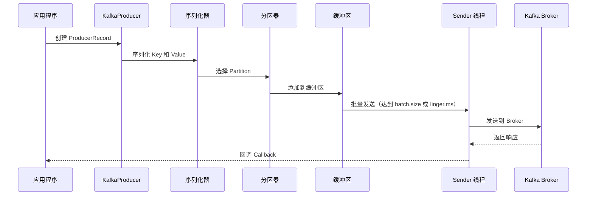
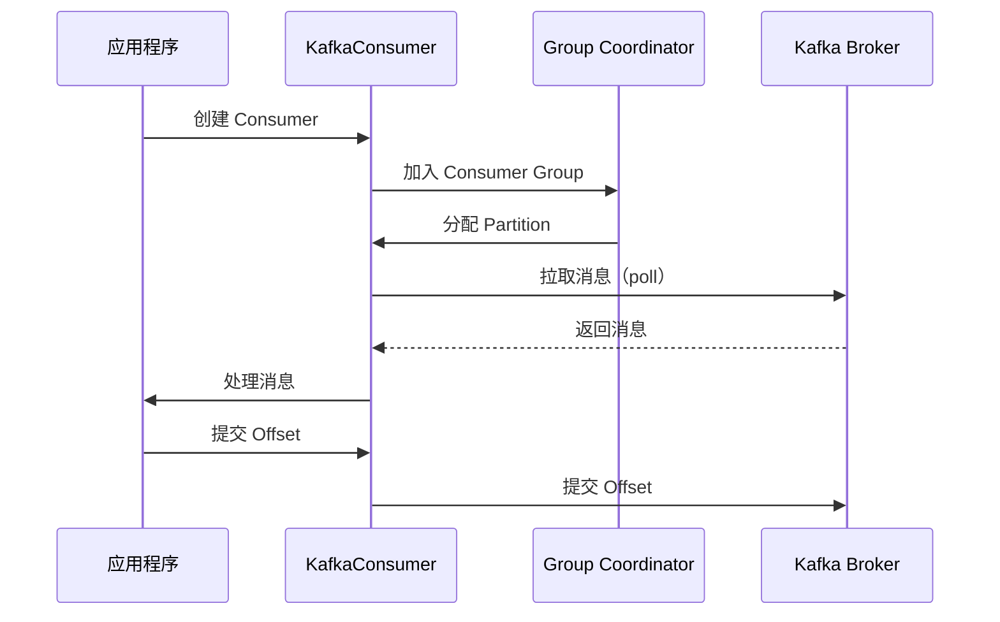

# Kafka 核心概念

## 📖 目录

- [1. Topic 和 Partition](#1-topic-和-partition)
- [2. Producer 详解](#2-producer-详解)
- [3. Consumer 详解](#3-consumer-详解)
- [4. Consumer Group 机制](#4-consumer-group-机制)
- [5. Offset 管理](#5-offset-管理)
- [6. 副本机制与高可用](#6-副本机制与高可用)
- [7. 常见面试题](#7-常见面试题)

---

## 1. Topic 和 Partition

### 1.1 Topic（主题）

#### 1.1.1 概念

**Topic** 是消息的逻辑分类，类似于数据库中的表。Producer 将消息发送到特定的 Topic，Consumer 从 Topic 中消费消息。

**特点**：
- 一个 Topic 可以有多个 Partition（分区）
- 多个 Producer 可以向同一个 Topic 发送消息
- 多个 Consumer Group 可以消费同一个 Topic
- Topic 是逻辑概念，Partition 是物理概念

#### 1.1.2 Topic 创建

```bash
# 创建 Topic
bin/kafka-topics.sh --create \
  --topic orders \
  --bootstrap-server localhost:9092 \
  --partitions 3 \
  --replication-factor 2

# 查看 Topic 详情
bin/kafka-topics.sh --describe \
  --topic orders \
  --bootstrap-server localhost:9092
```

**输出示例**：
```
Topic: orders	PartitionCount: 3	ReplicationFactor: 2	Configs: 
	Topic: orders	Partition: 0	Leader: 1	Replicas: 1,2	Isr: 1,2
	Topic: orders	Partition: 1	Leader: 2	Replicas: 2,3	Isr: 2,3
	Topic: orders	Partition: 2	Leader: 3	Replicas: 3,1	Isr: 3,1
```

#### 1.1.3 Topic 配置

**重要配置参数**：

| 参数 | 说明 | 默认值 |
|:---|:---|:---|
| `partitions` | 分区数量 | 1 |
| `replication-factor` | 副本因子 | 1 |
| `retention.ms` | 消息保留时间（毫秒） | 7天 |
| `retention.bytes` | 消息保留大小（字节） | -1（无限制） |
| `segment.ms` | Segment 滚动时间 | 7天 |
| `segment.bytes` | Segment 文件大小 | 1GB |
| `compression.type` | 压缩类型 | producer |

**示例**：
```bash
# 创建带自定义配置的 Topic
bin/kafka-topics.sh --create \
  --topic orders \
  --bootstrap-server localhost:9092 \
  --partitions 3 \
  --replication-factor 2 \
  --config retention.ms=86400000 \
  --config segment.bytes=1073741824
```

### 1.2 Partition（分区）

#### 1.2.1 概念

**Partition** 是 Topic 的物理分割，每个 Partition 是一个有序的消息队列。

**特点**：
- **顺序性**：Partition 内的消息是有序的
- **并行性**：不同 Partition 可以并行处理
- **扩展性**：通过增加 Partition 数量提高吞吐量
- **副本机制**：每个 Partition 可以有多个副本（Replica）

#### 1.2.2 Partition 的作用

!!! success "Partition 的核心作用"
    1. **提高吞吐量** - 多个 Partition 可以并行处理
    2. **负载均衡** - 消息分布到多个 Partition，避免单点压力
    3. **水平扩展** - 通过增加 Partition 数量实现水平扩展
    4. **顺序保证** - Partition 内消息有序（全局有序需要单 Partition）

#### 1.2.3 Partition 分配策略

**Producer 端分区策略**：

```java
// 1. 指定 Partition
ProducerRecord<String, String> record = new ProducerRecord<>(
    "orders", 
    0,              // 指定 Partition 0
    "key", 
    "value"
);

// 2. 指定 Key（根据 Key 的哈希值选择 Partition）
ProducerRecord<String, String> record = new ProducerRecord<>(
    "orders", 
    "order-123",    // Key，相同 Key 会发送到同一个 Partition
    "value"
);

// 3. 不指定 Key（轮询分配）
ProducerRecord<String, String> record = new ProducerRecord<>(
    "orders", 
    null,           // 无 Key，轮询分配
    "value"
);
```

**自定义分区器**：

```java
import org.apache.kafka.clients.producer.Partitioner;
import org.apache.kafka.common.Cluster;
import org.apache.kafka.common.PartitionInfo;

import java.util.List;
import java.util.Map;

/**
 * 自定义分区器
 * Custom Partitioner
 */
public class CustomPartitioner implements Partitioner {
    
    @Override
    public int partition(String topic, Object key, byte[] keyBytes, 
                        Object value, byte[] valueBytes, Cluster cluster) {
        List<PartitionInfo> partitions = cluster.partitionsForTopic(topic);
        int numPartitions = partitions.size();
        
        // 根据 Key 的哈希值选择 Partition
        if (keyBytes == null) {
            // 无 Key，轮询分配
            return (int) (Math.random() * numPartitions);
        }
        
        // 有 Key，根据哈希值分配
        return Math.abs(key.hashCode()) % numPartitions;
    }
    
    @Override
    public void close() {
        // 清理资源
    }
    
    @Override
    public void configure(Map<String, ?> configs) {
        // 读取配置
    }
}
```

#### 1.2.4 Partition 数量选择

**选择原则**：

1. **吞吐量需求** - 单个 Partition 的吞吐量有限（约 10MB/s），根据总吞吐量计算
2. **Consumer 数量** - Partition 数量应该 >= Consumer 数量（同一 Consumer Group）
3. **扩展性** - 预留一定的 Partition 数量，便于后续扩展
4. **顺序性需求** - 如果需要全局有序，只能使用 1 个 Partition

**计算公式**：
```
Partition 数量 = max(
    吞吐量需求 / 单个 Partition 吞吐量,
    Consumer 数量,
    最小 Partition 数量（如 3）
)
```

**示例**：
```
需求：100MB/s 吞吐量，5个 Consumer
单个 Partition 吞吐量：10MB/s
Partition 数量 = max(100/10, 5, 3) = max(10, 5, 3) = 10
```

---

## 2. Producer 详解

### 2.1 Producer 核心概念

#### 2.1.1 Producer 工作流程



#### 2.1.2 Producer 关键配置

| 配置项 | 说明 | 默认值 | 推荐值 |
|:---|:---|:---:|:---:|
| `bootstrap.servers` | Broker 地址列表 | - | localhost:9092 |
| `key.serializer` | Key 序列化器 | - | StringSerializer |
| `value.serializer` | Value 序列化器 | - | StringSerializer |
| `acks` | 消息确认机制 | 1 | all |
| `retries` | 重试次数 | 2147483647 | 3 |
| `batch.size` | 批次大小（字节） | 16384 | 32768 |
| `linger.ms` | 等待时间（毫秒） | 0 | 10 |
| `buffer.memory` | 缓冲区大小（字节） | 33554432 | 67108864 |
| `compression.type` | 压缩类型 | none | snappy |
| `max.in.flight.requests.per.connection` | 未确认请求数 | 5 | 1（需要顺序） |

### 2.2 消息确认机制（acks）

#### 2.2.1 acks 配置说明

**acks=0**：
- Producer 不等待任何确认
- **优点**：吞吐量最高，延迟最低
- **缺点**：可能丢失消息
- **适用场景**：日志收集等对丢失不敏感的场景

**acks=1**（默认）：
- Producer 等待 Leader 确认
- **优点**：平衡性能和可靠性
- **缺点**：Leader 故障可能丢失消息
- **适用场景**：一般业务场景

**acks=all**（或 `acks=-1`）：
- Producer 等待所有 ISR 副本确认
- **优点**：可靠性最高
- **缺点**：延迟较高，吞吐量较低
- **适用场景**：金融、支付等对可靠性要求高的场景

**配置示例**：
```java
Properties props = new Properties();
props.put(ProducerConfig.ACKS_CONFIG, "all"); // 等待所有 ISR 确认
props.put(ProducerConfig.MIN_INSYNC_REPLICAS_CONFIG, 2); // 最小同步副本数
```

### 2.3 批量发送

#### 2.3.1 批量发送机制

Kafka Producer 会将多个消息批量发送，减少网络开销，提高吞吐量。

**触发条件**：
1. **batch.size** - 批次大小达到阈值
2. **linger.ms** - 等待时间达到阈值
3. **缓冲区满** - 缓冲区空间不足

**配置示例**：
```java
Properties props = new Properties();
props.put(ProducerConfig.BATCH_SIZE_CONFIG, 32768);      // 32KB
props.put(ProducerConfig.LINGER_MS_CONFIG, 10);          // 等待 10ms
props.put(ProducerConfig.BUFFER_MEMORY_CONFIG, 67108864); // 64MB
```

#### 2.3.2 批量发送示例

```java
import org.apache.kafka.clients.producer.KafkaProducer;
import org.apache.kafka.clients.producer.ProducerConfig;
import org.apache.kafka.clients.producer.ProducerRecord;
import org.apache.kafka.common.serialization.StringSerializer;

import java.util.Properties;

/**
 * 批量发送示例
 * Batch Send Example
 */
public class BatchProducer {
    
    public static void main(String[] args) {
        Properties props = new Properties();
        props.put(ProducerConfig.BOOTSTRAP_SERVERS_CONFIG, "localhost:9092");
        props.put(ProducerConfig.KEY_SERIALIZER_CLASS_CONFIG, StringSerializer.class.getName());
        props.put(ProducerConfig.VALUE_SERIALIZER_CLASS_CONFIG, StringSerializer.class.getName());
        
        // 批量发送配置
        props.put(ProducerConfig.BATCH_SIZE_CONFIG, 32768);      // 32KB
        props.put(ProducerConfig.LINGER_MS_CONFIG, 10);          // 等待 10ms
        props.put(ProducerConfig.COMPRESSION_TYPE_CONFIG, "snappy"); // 压缩
        
        KafkaProducer<String, String> producer = new KafkaProducer<>(props);
        
        // 批量发送消息
        for (int i = 0; i < 1000; i++) {
            ProducerRecord<String, String> record = new ProducerRecord<>(
                "orders",
                "order-" + i,
                "order-data-" + i
            );
            producer.send(record);
        }
        
        // 确保所有消息发送完成
        producer.flush();
        producer.close();
    }
}
```

### 2.4 幂等性 Producer

#### 2.4.1 幂等性概念

**幂等性**：多次执行同一操作，结果相同。

**Kafka 幂等性**：
- 保证同一消息只被写入一次（即使重试）
- 通过 Producer ID（PID）和序列号（Sequence Number）实现

#### 2.4.2 启用幂等性

```java
Properties props = new Properties();
props.put(ProducerConfig.ENABLE_IDEMPOTENCE_CONFIG, true); // 启用幂等性
// 启用幂等性后，以下配置会自动设置：
// acks=all
// retries=Integer.MAX_VALUE
// max.in.flight.requests.per.connection=5
```

**工作原理**：
1. Broker 为每个 Producer 分配唯一的 PID
2. Producer 为每个消息分配序列号
3. Broker 检查序列号，拒绝重复消息

### 2.5 事务 Producer

#### 2.5.1 事务概念

**事务**：保证多个消息的原子性（要么全部成功，要么全部失败）。

**使用场景**：
- 需要保证多个消息的原子性
- 需要保证"精确一次"语义（Exactly-Once Semantics）

#### 2.5.2 事务 Producer 示例

```java
import org.apache.kafka.clients.producer.KafkaProducer;
import org.apache.kafka.clients.producer.ProducerConfig;
import org.apache.kafka.clients.producer.ProducerRecord;
import org.apache.kafka.clients.producer.TransactionRecord;
import org.apache.kafka.common.serialization.StringSerializer;

import java.util.Properties;

/**
 * 事务 Producer 示例
 * Transactional Producer Example
 */
public class TransactionalProducer {
    
    public static void main(String[] args) {
        Properties props = new Properties();
        props.put(ProducerConfig.BOOTSTRAP_SERVERS_CONFIG, "localhost:9092");
        props.put(ProducerConfig.KEY_SERIALIZER_CLASS_CONFIG, StringSerializer.class.getName());
        props.put(ProducerConfig.VALUE_SERIALIZER_CLASS_CONFIG, StringSerializer.class.getName());
        
        // 事务配置
        props.put(ProducerConfig.TRANSACTIONAL_ID_CONFIG, "txn-producer-1");
        props.put(ProducerConfig.ENABLE_IDEMPOTENCE_CONFIG, true);
        
        KafkaProducer<String, String> producer = new KafkaProducer<>(props);
        
        // 初始化事务
        producer.initTransactions();
        
        try {
            // 开始事务
            producer.beginTransaction();
            
            // 发送多条消息
            producer.send(new ProducerRecord<>("orders", "order-1", "order-data-1"));
            producer.send(new ProducerRecord<>("payments", "payment-1", "payment-data-1"));
            producer.send(new ProducerRecord<>("inventory", "inventory-1", "inventory-data-1"));
            
            // 提交事务
            producer.commitTransaction();
            
        } catch (Exception e) {
            // 回滚事务
            producer.abortTransaction();
            e.printStackTrace();
        } finally {
            producer.close();
        }
    }
}
```

---

## 3. Consumer 详解

### 3.1 Consumer 核心概念

#### 3.1.1 Consumer 工作流程



#### 3.1.2 Consumer 关键配置

| 配置项 | 说明 | 默认值 | 推荐值 |
|:---|:---|:---:|:---:|
| `bootstrap.servers` | Broker 地址列表 | - | localhost:9092 |
| `group.id` | Consumer Group ID | - | my-consumer-group |
| `key.deserializer` | Key 反序列化器 | - | StringDeserializer |
| `value.deserializer` | Value 反序列化器 | - | StringDeserializer |
| `auto.offset.reset` | 偏移量重置策略 | latest | earliest |
| `enable.auto.commit` | 是否自动提交 Offset | true | false |
| `auto.commit.interval.ms` | 自动提交间隔 | 5000 | - |
| `max.poll.records` | 每次拉取的最大记录数 | 500 | 500 |
| `max.poll.interval.ms` | 最大拉取间隔 | 300000 | 300000 |
| `session.timeout.ms` | Session 超时时间 | 45000 | 30000 |

### 3.2 Consumer 拉取消息

#### 3.2.1 poll() 方法

**poll()** 是 Consumer 的核心方法，用于从 Kafka 拉取消息。

```java
import org.apache.kafka.clients.consumer.ConsumerConfig;
import org.apache.kafka.clients.consumer.ConsumerRecord;
import org.apache.kafka.clients.consumer.ConsumerRecords;
import org.apache.kafka.clients.consumer.KafkaConsumer;
import org.apache.kafka.common.serialization.StringDeserializer;

import java.time.Duration;
import java.util.Collections;
import java.util.Properties;

/**
 * Consumer 拉取消息示例
 * Consumer Poll Example
 */
public class SimpleConsumer {
    
    public static void main(String[] args) {
        Properties props = new Properties();
        props.put(ConsumerConfig.BOOTSTRAP_SERVERS_CONFIG, "localhost:9092");
        props.put(ConsumerConfig.GROUP_ID_CONFIG, "my-consumer-group");
        props.put(ConsumerConfig.KEY_DESERIALIZER_CLASS_CONFIG, StringDeserializer.class.getName());
        props.put(ConsumerConfig.VALUE_DESERIALIZER_CLASS_CONFIG, StringDeserializer.class.getName());
        props.put(ConsumerConfig.AUTO_OFFSET_RESET_CONFIG, "earliest");
        
        KafkaConsumer<String, String> consumer = new KafkaConsumer<>(props);
        consumer.subscribe(Collections.singletonList("orders"));
        
        try {
            while (true) {
                // 拉取消息（超时时间 100ms）
                ConsumerRecords<String, String> records = consumer.poll(Duration.ofMillis(100));
                
                // 处理消息
                for (ConsumerRecord<String, String> record : records) {
                    System.out.printf(
                        "topic=%s, partition=%d, offset=%d, key=%s, value=%s%n",
                        record.topic(),
                        record.partition(),
                        record.offset(),
                        record.key(),
                        record.value()
                    );
                    
                    // 业务处理
                    processMessage(record);
                }
            }
        } finally {
            consumer.close();
        }
    }
    
    private static void processMessage(ConsumerRecord<String, String> record) {
        // 业务逻辑处理
        // Business logic processing
    }
}
```

#### 3.2.2 拉取模式

**拉取模式（Pull Model）**：
- Consumer 主动从 Broker 拉取消息
- **优点**：Consumer 可以控制消费速度，避免消息积压
- **缺点**：需要轮询，可能拉取到空消息

**推送模式（Push Model）**：
- Broker 主动推送消息给 Consumer
- **优点**：实时性好
- **缺点**：Consumer 无法控制速度，可能导致消息积压

### 3.3 Offset 提交策略

#### 3.3.1 自动提交（不推荐）

```java
props.put(ConsumerConfig.ENABLE_AUTO_COMMIT_CONFIG, true);
props.put(ConsumerConfig.AUTO_COMMIT_INTERVAL_MS_CONFIG, 5000); // 每 5 秒提交一次
```

**问题**：
- 可能在消息处理完成前提交 Offset，导致消息丢失
- 可能在消息处理失败后提交 Offset，导致消息重复

#### 3.3.2 手动提交（推荐）

**同步提交**：
```java
props.put(ConsumerConfig.ENABLE_AUTO_COMMIT_CONFIG, false);

// 处理消息后手动提交
for (ConsumerRecord<String, String> record : records) {
    processMessage(record);
}
consumer.commitSync(); // 同步提交，会阻塞
```

**异步提交**：
```java
consumer.commitAsync(new OffsetCommitCallback() {
    @Override
    public void onComplete(Map<TopicPartition, OffsetAndMetadata> offsets, Exception exception) {
        if (exception != null) {
            System.err.println("提交 Offset 失败: " + exception.getMessage());
        } else {
            System.out.println("提交 Offset 成功");
        }
    }
});
```

**最佳实践**：
```java
try {
    while (true) {
        ConsumerRecords<String, String> records = consumer.poll(Duration.ofMillis(100));
                
        for (ConsumerRecord<String, String> record : records) {
            try {
                // 处理消息
                processMessage(record);
            } catch (Exception e) {
                // 处理失败，记录日志，不提交 Offset
                System.err.println("处理消息失败: " + e.getMessage());
                continue;
            }
        }
        
        // 所有消息处理完成后，异步提交 Offset
        consumer.commitAsync();
    }
} catch (Exception e) {
    System.err.println("消费异常: " + e.getMessage());
} finally {
    try {
        // 关闭前同步提交，确保 Offset 提交成功
        consumer.commitSync();
    } finally {
        consumer.close();
    }
}
```

---

## 4. Consumer Group 机制

### 4.1 Consumer Group 概念

#### 4.1.1 定义

**Consumer Group** 是一组 Consumer 的集合，共同消费一个或多个 Topic。

**特点**：
- **负载均衡**：同一个 Consumer Group 内的 Consumer 平均分配 Partition
- **并行消费**：多个 Consumer 可以并行消费不同的 Partition
- **故障转移**：Consumer 故障时，其 Partition 会分配给其他 Consumer
- **多订阅者**：多个 Consumer Group 可以同时消费同一个 Topic

#### 4.1.2 Consumer Group 分配策略

**Range 分配策略**（默认）：
- 按 Partition 范围分配
- **优点**：分配简单
- **缺点**：可能导致分配不均

**RoundRobin 分配策略**：
- 轮询分配 Partition
- **优点**：分配均匀
- **缺点**：需要所有 Consumer 订阅相同的 Topic

**Sticky 分配策略**：
- 尽量保持原有分配，减少重平衡
- **优点**：减少重平衡开销
- **缺点**：实现复杂

**配置示例**：
```java
props.put(ConsumerConfig.PARTITION_ASSIGNMENT_STRATEGY_CONFIG, 
    "org.apache.kafka.clients.consumer.RoundRobinAssignor");
```

### 4.2 Consumer Group 重平衡（Rebalance）

#### 4.2.1 重平衡触发条件

1. **Consumer 加入** - 新的 Consumer 加入 Consumer Group
2. **Consumer 离开** - Consumer 故障或主动离开
3. **Topic Partition 变化** - Topic 的 Partition 数量变化
4. **订阅 Topic 变化** - Consumer 订阅的 Topic 列表变化

#### 4.2.2 重平衡过程

```mermaid
sequenceDiagram
    participant C1 as Consumer 1
    participant C2 as Consumer 2
    participant C3 as Consumer 3 (新加入)
    participant Coordinator as Group Coordinator
    
    Note over C1,C2: 正常消费中
    C3->>Coordinator: 加入 Consumer Group
    Coordinator->>C1: 停止消费，释放 Partition
    Coordinator->>C2: 停止消费，释放 Partition
    Coordinator->>C1: 重新分配 Partition
    Coordinator->>C2: 重新分配 Partition
    Coordinator->>C3: 分配 Partition
    Note over C1,C2,C3: 重新开始消费
```

#### 4.2.3 减少重平衡

**策略**：
1. **增加 Session 超时时间** - `session.timeout.ms=30000`
2. **增加心跳间隔** - `heartbeat.interval.ms=3000`
3. **快速处理消息** - 避免 `max.poll.interval.ms` 超时
4. **使用 Sticky 分配策略** - 减少重平衡次数

---

## 5. Offset 管理

### 5.1 Offset 存储位置

#### 5.1.1 Kafka 内部 Topic（推荐）

**Kafka 0.9+**：Offset 存储在 Kafka 内部 Topic `__consumer_offsets`

**优点**：
- 高性能（Kafka 本身的高性能）
- 支持高可用（副本机制）
- 不需要额外的存储系统

**配置**：
```java
// 默认就是存储在 Kafka 内部 Topic，无需额外配置
props.put(ConsumerConfig.ENABLE_AUTO_COMMIT_CONFIG, false);
```

#### 5.1.2 Zookeeper（已废弃）

**Kafka 0.8**：Offset 存储在 Zookeeper

**缺点**：
- 性能较差
- 不支持高并发写入
- Kafka 0.9+ 已废弃

### 5.2 Offset 提交方式

#### 5.2.1 自动提交

```java
props.put(ConsumerConfig.ENABLE_AUTO_COMMIT_CONFIG, true);
props.put(ConsumerConfig.AUTO_COMMIT_INTERVAL_MS_CONFIG, 5000);
```

**问题**：可能在消息处理完成前提交 Offset

#### 5.2.2 手动提交

**同步提交**：
```java
consumer.commitSync(); // 阻塞直到提交成功
```

**异步提交**：
```java
consumer.commitAsync(); // 非阻塞，不等待结果
```

**指定 Offset 提交**：
```java
Map<TopicPartition, OffsetAndMetadata> offsets = new HashMap<>();
offsets.put(new TopicPartition("orders", 0), new OffsetAndMetadata(100L));
consumer.commitSync(offsets);
```

### 5.3 Offset 重置策略

#### 5.3.1 auto.offset.reset 配置

**earliest**：
- 从最早的 Offset 开始消费
- **适用场景**：需要处理历史消息

**latest**（默认）：
- 从最新的 Offset 开始消费
- **适用场景**：只处理新消息

**none**：
- 如果没有 Offset，抛出异常
- **适用场景**：严格要求 Offset 存在

**配置示例**：
```java
props.put(ConsumerConfig.AUTO_OFFSET_RESET_CONFIG, "earliest");
```

#### 5.3.2 手动重置 Offset

```java
// 重置到指定 Offset
TopicPartition partition = new TopicPartition("orders", 0);
consumer.assign(Collections.singletonList(partition));
consumer.seek(partition, 100L); // 重置到 Offset 100

// 重置到最早
consumer.seekToBeginning(Collections.singletonList(partition));

// 重置到最新
consumer.seekToEnd(Collections.singletonList(partition));
```

---

## 6. 副本机制与高可用

### 6.1 副本概念

#### 6.1.1 Leader 和 Follower

**Leader Replica**：
- 处理读写请求的主副本
- 每个 Partition 只有一个 Leader

**Follower Replica**：
- 从 Leader 同步数据的副本
- 不处理读写请求（Kafka 2.4+ 支持 Follower 读取）

#### 6.1.2 ISR（In-Sync Replicas）

**ISR**：与 Leader 保持同步的副本集合

**ISR 条件**：
1. **时间同步** - Follower 在 `replica.lag.time.max.ms` 内与 Leader 同步
2. **消息同步** - Follower 的 Offset 与 Leader 的 Offset 差距在阈值内

**配置**：
```properties
# Broker 配置
replica.lag.time.max.ms=10000  # Follower 延迟时间阈值（10秒）
min.insync.replicas=2           # 最小同步副本数
```

### 6.2 故障转移

#### 6.2.1 Leader 故障

**过程**：
1. Zookeeper 检测到 Leader 故障
2. 从 ISR 中选择新的 Leader
3. 其他 Follower 从新 Leader 同步数据
4. Producer 和 Consumer 重新连接到新 Leader

**示例**：
```
初始状态：
  Partition 0: Leader=Broker1, ISR=[Broker1, Broker2, Broker3]

Broker1 故障后：
  Partition 0: Leader=Broker2, ISR=[Broker2, Broker3]
```

#### 6.2.2 副本不足

**min.insync.replicas**：
- 最小同步副本数
- 如果 ISR 数量 < min.insync.replicas，Producer 写入会失败

**配置示例**：
```properties
# Broker 配置
min.insync.replicas=2  # 至少需要 2 个同步副本

# Producer 配置
acks=all  # 等待所有 ISR 确认
```

---

## 7. 常见面试题

### Q1: Kafka 如何保证消息不丢失？

**答案要点**：

1. **Producer 端**：
   - `acks=all` - 等待所有 ISR 确认
   - `retries` - 设置重试次数
   - `enable.idempotence=true` - 启用幂等性

2. **Broker 端**：
   - `replication.factor>=3` - 副本因子 >= 3
   - `min.insync.replicas>=2` - 最小同步副本数 >= 2
   - 使用可靠的存储（如 SSD）

3. **Consumer 端**：
   - `enable.auto.commit=false` - 关闭自动提交
   - 手动提交 Offset - 消息处理完成后再提交

### Q2: Kafka 如何保证消息顺序？

**答案要点**：

1. **Partition 内有序** - Kafka 只保证 Partition 内的消息有序
2. **Key 分区策略** - 相同 Key 的消息发送到同一个 Partition
3. **单 Partition 单 Consumer** - 一个 Partition 只能被一个 Consumer 消费
4. **Producer 配置** - `max.in.flight.requests.per.connection=1`

**限制**：
- Kafka 不保证全局有序，只保证 Partition 内有序
- 如果需要全局有序，可以设置 `partitions=1`，但会降低吞吐量

### Q3: Consumer Group 的作用是什么？

**答案要点**：

1. **负载均衡** - 同一个 Consumer Group 内的 Consumer 平均分配 Partition
2. **并行消费** - 多个 Consumer 可以并行消费不同的 Partition
3. **故障转移** - Consumer 故障时，其 Partition 会分配给其他 Consumer
4. **多订阅者** - 多个 Consumer Group 可以同时消费同一个 Topic

### Q4: 什么是 Rebalance？如何减少 Rebalance？

**答案要点**：

**Rebalance**：Consumer Group 重新分配 Partition 的过程

**触发条件**：
- Consumer 加入或离开
- Topic Partition 数量变化
- 订阅 Topic 列表变化

**减少 Rebalance**：
1. 增加 `session.timeout.ms` - Session 超时时间
2. 增加 `heartbeat.interval.ms` - 心跳间隔
3. 快速处理消息 - 避免 `max.poll.interval.ms` 超时
4. 使用 Sticky 分配策略

### Q5: Kafka 的副本机制是什么？

**答案要点**：

1. **Leader 和 Follower** - 每个 Partition 有一个 Leader 和多个 Follower
2. **读写分离** - 只有 Leader 处理读写请求
3. **ISR 机制** - 与 Leader 保持同步的副本集合
4. **故障转移** - Leader 故障时，从 ISR 中选择新的 Leader

**配置**：
- `replication.factor` - 副本因子（建议 3）
- `min.insync.replicas` - 最小同步副本数（建议 2）

---

## 📚 扩展阅读

- [Kafka Producer 配置](https://kafka.apache.org/documentation/#producerconfigs)
- [Kafka Consumer 配置](https://kafka.apache.org/documentation/#consumerconfigs)
- [Kafka 设计文档](https://kafka.apache.org/documentation/#design)

---

💡 **学习提示**：理解 Kafka 的核心概念是掌握 Kafka 的基础，建议结合实际项目加深理解。

🔄 持续更新中... | 最后更新：2025年1月

